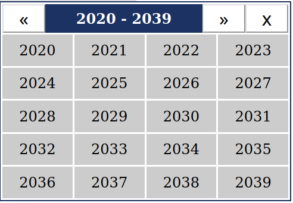
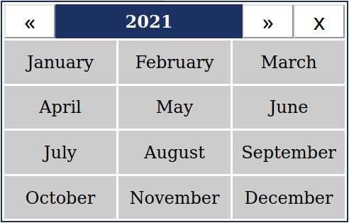
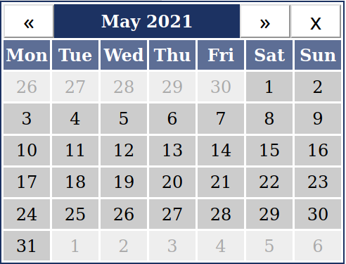

# Seed Datepicker

[](https://github.com/tommket/seed-datepicker/actions?query=workflow%3ACI)
[](https://github.com/tommket/seed-datepicker/actions?query=workflow%3A%22Build+Examples%22)
[](https://crates.io/crates/seed-datepicker)

This is a customizable Datepicker component for the [Seed framework](https://seed-rs.org/) that uses [Chrono](https://crates.io/crates/chrono) for the date structures.

If you want to use this library, you can use the scss styling that is provided for the examples [here](static/seed-datepicker.scss), or you can make your own styling for it, all you have to do is use the correct class names and their nesting.

## Usage

See [Examples](https://github.com/tommket/seed-datepicker/tree/master/examples).

### Views and selection

The datepicker dialog has 3 different `DialogViewType`s that work as follows:

#### `DialogViewType::Years`

Displays a selection from 20 years starting from a year of which `modulo 20 == 0`.

Clicking the title of the dialog has no effect.

- Clicking a year if `selection_type == DialogViewType::Years`:
  - selects the January 1st of that year (since the underlying storage type is a `NaiveDate` from chrono)
- Clicking a year if `selection_type != DialogViewType::Years`:
  - changes the `DialogViewType` to `DialogViewType::Months`



#### `DialogViewType::Months`

Displays a selection from all the 12 months of a particullar year.

Clicking the title of the dialog changes the `DialogViewType` to `DialogViewType::Years`

- Clicking a month if `selection_type == DialogViewType::Months`:
  - selects the 1st day of the selected month (since the underlying storage type is a `NaiveDate` from chrono)
- Clicking a month if `selection_type == DialogViewType::Days`:
  - changes the `DialogViewType` to `DialogViewType::Days` to display the days of that particular month.



#### `DialogViewType::Days`

- Displays a selection from all the days of a particullar month.
- Clicking the title of the dialog changes the `DialogViewType` to `DialogViewType::Months`

- Clicking a day selects that particullar date as a `NaiveDate`



### Constraints

During the configuration of the datepicker in the `init` method, various constraints can be applied, for example:

```rust
let config = PickerConfigBuilder::default()
        .date_constraints(
            DateConstraintsBuilder::default()
                // earliest selectable date
                .min_date(NaiveDate::from_ymd(2020, 12, 1))
                // latest selectable date
                .max_date(NaiveDate::from_ymd(2022, 12, 14))
                // chrono Weekday-s that can be disabled
                .disabled_weekdays([Weekday::Sat, Weekday::Sun].iter().cloned().collect())
                // entire chrono Month-s that can be disabled
                .disabled_months([Month::July, Month::August].iter().cloned().collect())
                // entire years that can be disabled
                .disabled_years([2021].iter().cloned().collect())
                // a particular day of month that is disabled in all months
                .disabled_monthly_dates([13].iter().cloned().collect())
                // particular dates that are disabled each year (the year number is ignored here)
                .disabled_yearly_dates(vec![
                    NaiveDate::from_ymd(1, 12, 24),
                    NaiveDate::from_ymd(1, 12, 25),
                    NaiveDate::from_ymd(1, 12, 26),
                ])
                // particular unique dates that can be disabled
                .disabled_unique_dates([NaiveDate::from_ymd(2020, 12, 8)].iter().cloned().collect())
                .build()
                .unwrap(),
        )
        .build()
        .unwrap();
```
