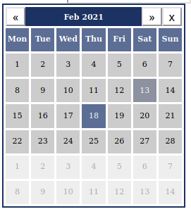

# Simple example of the datepicker

Does not use any extra configurations.

## Build

All examples use [Trunk](https://github.com/thedodd/trunk) as the build tool.

Once you've installed Trunk, simply execute `trunk serve --open` from this example's directory, and you should see the web application rendered in your browser. Click on the texbox to open the datepicker dialog.

